# TravelIsrael — React Frontend

פלטפורמת **TravelIsrael** לגלישה, תכנון ויצירת טיולים בישראל.  
האפליקציה מאפשרת למשתמשים לגלות מסלולים קיימים, לקבל המלצות מותאמות אישית, לבנות טיול משלהם, ולנהל את הפעילות שלהם — עם פאנל ניהול מלא למנהלי המערכת.

> **Repository זה:** [TravelIsrael-react](https://github.com/injosh2026/TravelIsrael-react)  
> **Backend (.NET 8):** [TravelIsrael-dotnet](https://github.com/injosh2026/TravelIsrael-dotnet)

**פרויקט לימודי** — נבנה בזוגות במסגרת קורס.

> **Deployment:** כרגע אין סביבת Production — ההרצה היא מקומית בלבד (Local Development).

---

## תוכן עניינים

- [תכונות עיקריות](#תכונות-עיקריות)
- [ארכיטקטורה](#ארכיטקטורה)
- [מסד הנתונים](#מסד-הנתונים)
- [טכנולוגיות](#טכנולוגיות)
- [דרישות מקדימות](#דרישות-מקדימות)
- [התקנה והרצה](#התקנה-והרצה)
- [חיבור ל-API](#חיבור-ל-api)
- [צילומי מסך](#צילומי-מסך)
- [מבנה הפרויקט](#מבנה-הפרויקט)
- [סקריפטים](#סקריפטים)
- [מסכים ונתיבים](#מסכים-ונתיבים)

---

## תכונות עיקריות

### למשתמשים
- **דף בית** — הצגת טיולים מובילים וניווט מהיר לתכנון
- **רשימת טיולים** — חיפוש וסינון לפי אזור, סוג, קושי ופרמטרים נוספים
- **פרטי טיול** — גלריה, תיאור, תחנות במסלול, ביקורות ודירוגים
- **אשף תכנון טיול** — המלצות חכמות לפי:
  - אזור גיאוגרפי
  - רמת קושי
  - נגישות
  - סוג טיול
  - העדפות (יום גשום, תקציב, שעות פנויות)
- **בניית טיול אישי** — יצירה ועריכה של מסלול עם תחנות, הצעות חכמות ושליחה לאישור
- **אזור אישי** — ניהול פרופיל, סטטיסטיקות וטיולים שמורים
- **הרשמה והתחברות** — JWT עם Refresh Token אוטומטי

### למנהלים
- **Dashboard** — סטטיסטיקות כלליות
- **ניהול טיולים** — צפייה, סינון ועריכה
- **אישור טיולים ממתינים** — אישור / דחייה של טיולים שהמשתמשים יצרו
- **ניהול מקומות** — הוספה, עריכה ומחיקה
- **ניהול משתמשים** — צפייה, חסימה ומחיקה

---

## ארכיטקטורה

הפרויקט בנוי כ-**Full Stack** עם הפרדה בין Client ל-Server:

```
┌─────────────────────┐       HTTPS / REST API       ┌─────────────────────┐
│   React Frontend    │  ◄────────────────────────►  │  .NET 8 Backend     │
│   (Repository זה)   │       localhost:7081/api     │  TravelIsrael-dotnet│
└─────────────────────┘                              └──────────┬──────────┘
                                                                │
                                                                ▼
                                                     ┌─────────────────────┐
                                                     │     SQL Server      │
                                                     │   ProjectTripsDB    │
                                                     └─────────────────────┘
```

| שכבה | טכנולוגיה | Repository |
|------|-----------|------------|
| Frontend | React 19, TypeScript, Vite | `TravelIsrael-react` |
| Backend | C# / ASP.NET Core **.NET 8** | `TravelIsrael-dotnet` |
| Database | Microsoft SQL Server — **`ProjectTripsDB`** | ב-repo של ה-Backend |

---

## מסד הנתונים

### איפה הנתונים נשמרים?

מסד הנתונים **`ProjectTripsDB`** **לא** נמצא בתוך repository של ה-Frontend.  
הוא רץ על **SQL Server** (ברירת מחדל: `(localdb)\MSSQLLocalDB`) **במחשב המפתח**.

| מה | איפה |
|----|------|
| **הנתונים עצמם** (טיולים, מקומות, משתמשים…) | SQL Server LocalDB / SQL Server Express — מקומית על המחשב |
| **מבנה הטבלאות (Schema)** | EF Core Migrations — בתיקייה `ProjectTripsDB/Migrations/` ב-repo **[TravelIsrael-dotnet](https://github.com/injosh2026/TravelIsrael-dotnet)** |
| **משתמש Admin ראשוני** | נוצר אוטומטית ב-Migration (Seed) |

### איך מריצים עם נתונים?

**שלב 1 — יצירת מסד וטבלאות (חובה):**

```bash
# מתוך repository של ה-Backend (TravelIsrael-dotnet)
dotnet ef database update --project ProjectTripsDB --startup-project ProjectTrips
```

פעולה זו יוצרת את `ProjectTripsDB` ואת כל הטבלאות.  
לאחריה קיים משתמש Admin ראשוני:

| שדה | ערך |
|-----|-----|
| Email | `Admin@gmail.com` |
| Password | `Admin#613` |

**שלב 2 — נתוני דוגמה (טיולים, ביקורות וכו'):**

כרגע **אין** קובץ גיבוי (`.bak` / `.bacpac`) ב-repository.  
כדי לראות תוכן באפליקציה, יש שתי אפשרויות:

1. **להזין נתונים דרך האפליקציה** — הרשמה, יצירת טיולים, הוספת מקומות (Admin)
2. **להריץ סקריפטי SQL** — אם יסופקו ב-repo של ה-Backend (תיקיית `Database/` / `Scripts/`)

> **חשוב:** Connection String מוגדר ב-Backend בקובץ `ProjectTripsDB/Models/ProjectTripsDataBase.cs`.  
> אם SQL Server שלך רץ על שרת אחר — עדכני את השורה בהתאם לפני הרצת Migrations.

---

## טכנולוגיות

| קטגוריה | ספריות |
|---------|--------|
| Framework | React 19, TypeScript |
| Build | Vite 7 |
| Routing | React Router DOM 7 |
| State | Redux Toolkit |
| HTTP | Axios (Interceptors + JWT Refresh) |
| Styling | Tailwind CSS 3 |
| Icons | Lucide React, React Icons, React Feather |
| Lint | ESLint 9 |

---

## דרישות מקדימות

- [Node.js](https://nodejs.org/) (גרסה 18 ומעלה מומלצת)
- npm
- **[.NET 8 SDK](https://dotnet.microsoft.com/download/dotnet/8.0)** — ל-Backend
- **SQL Server** / **LocalDB** — מסד `ProjectTripsDB` (ראו [מסד הנתונים](#מסד-הנתונים))

---

## התקנה והרצה

### 1. Clone

```bash
git clone https://github.com/injosh2026/TravelIsrael-react.git
cd TravelIsrael-react
```

### 2. התקנת תלויות

```bash
npm install
```

### 3. הרצת Backend + DB

1. Clone את [TravelIsrael-dotnet](https://github.com/injosh2026/TravelIsrael-dotnet)
2. הריצי Migrations (ראו [מסד הנתונים](#מסד-הנתונים))
3. הריצי את שרת ה-API:

```bash
dotnet run --project ProjectTrips
```

### 4. הרצת Frontend (Development)

```bash
npm run dev
```

האפליקציה תיפתח בכתובת: `http://localhost:5173`

### 5. Build ל-Production (מקומי)

```bash
npm run build
npm run preview
```

---

## חיבור ל-API

כתובת ה-API מוגדרת ב-`src/services/axios.ts`:

```typescript
const baseURL = 'https://localhost:7081/api';
```

> **שימי לב:** ברירת המחדל היא HTTPS על פורט `7081`.  
> אם שרת ה-.NET שלך רץ על כתובת אחרת — עדכני את `baseURL` בהתאם.

### Endpoints עיקריים (Backend)

| Controller | תיאור |
|------------|--------|
| `Auth` | הרשמה, התחברות, Refresh Token, פרופיל |
| `User` | עדכון פרופיל, שינוי סיסמה |
| `DayTrip` | טיולים, סינון, המלצות, יצירה |
| `Lookups` | נתוני עזר (אזורים, קושי, נגישות) |
| `Suggestions` | הצעות תחנות לבניית מסלול |
| `Place` / `Route` | ניהול מקומות ומסלולים |
| `Admin` | סטטיסטיקות וניהול מערכת |
| `Type` | סוגי טיול |

---

## צילומי מסך

### דף בית וגלישה

**דף בית** (`/home`)

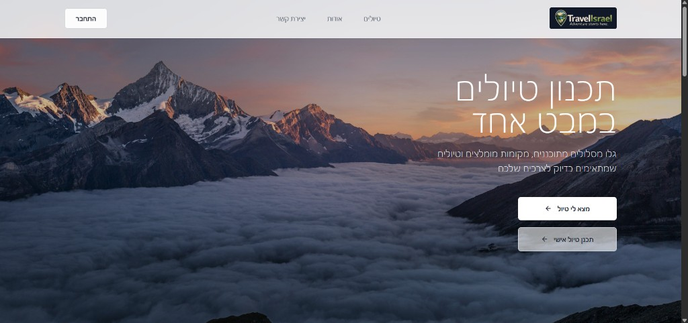

**רשימת טיולים + סינון** (`/trips`)

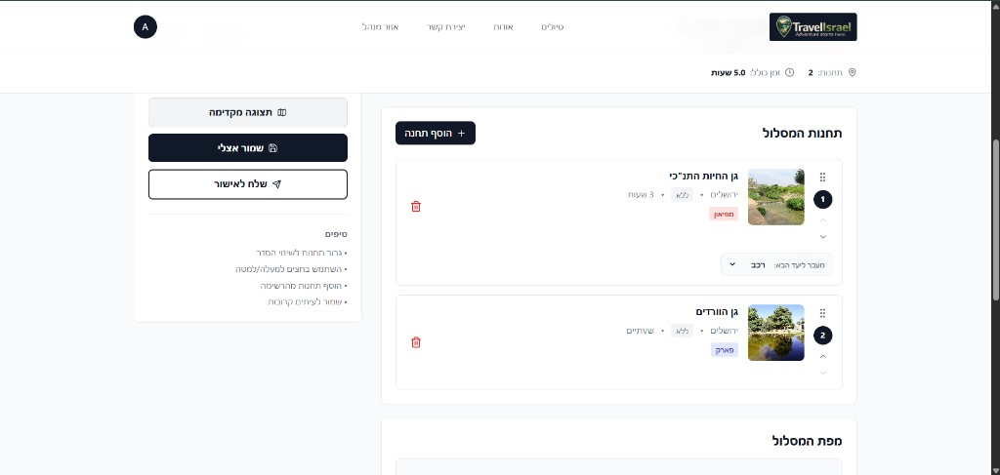

---

### פרטי טיול

**כרטיס טיול** (`/trips/:id`)

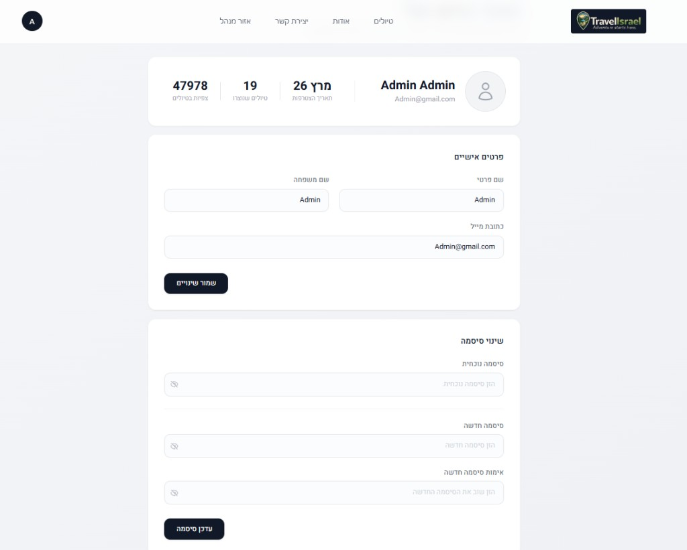

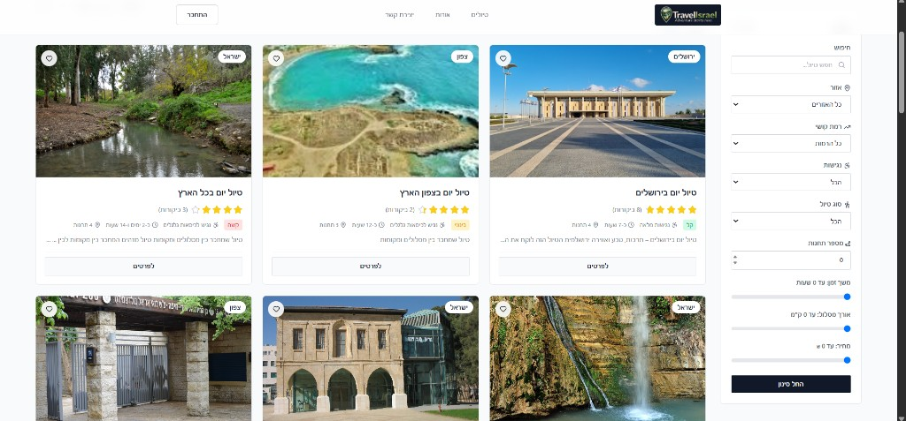

**תחנות במסלול**

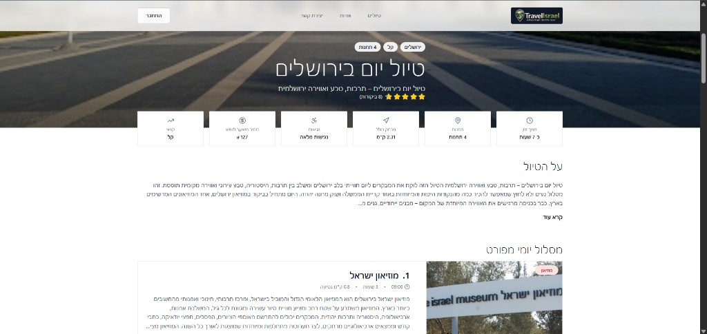

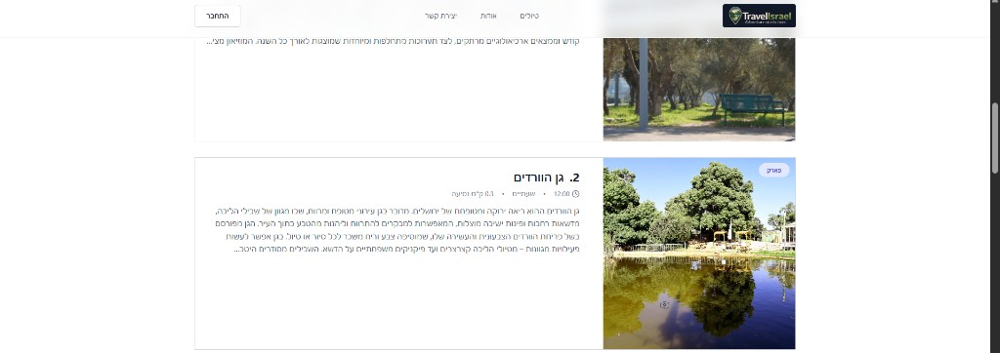

**גלריה, מפה וביקורות**

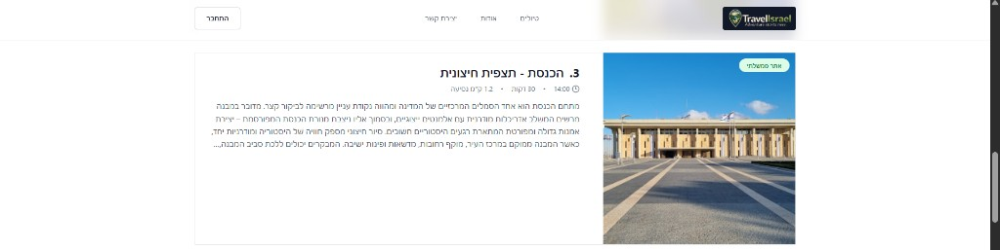

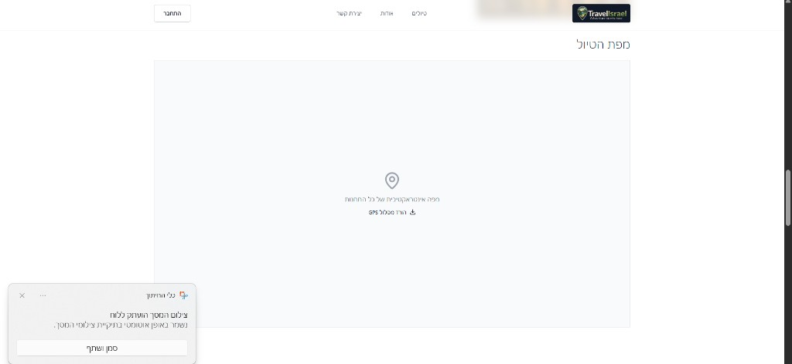

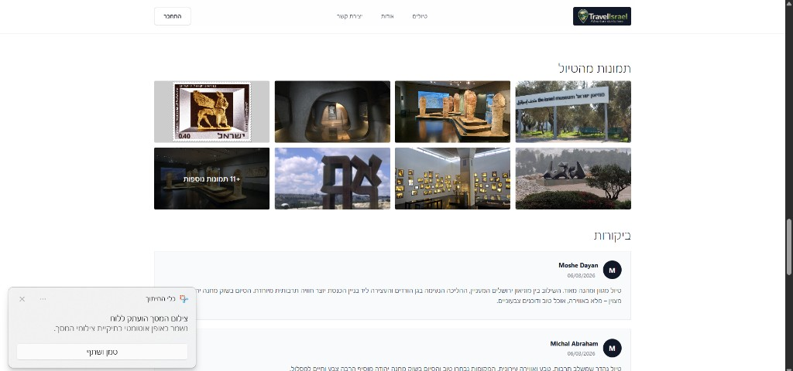

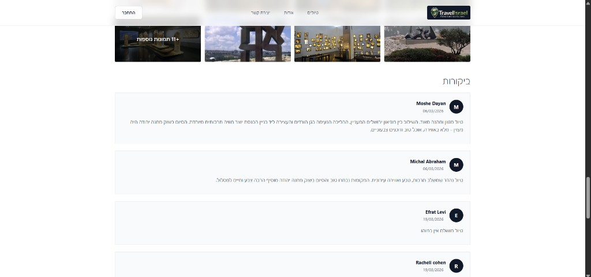

---

### אשף תכנון טיול

**בחירת אזור** (`/tripPlan`)

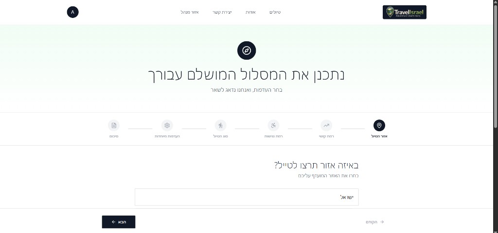

**רמת קושי**

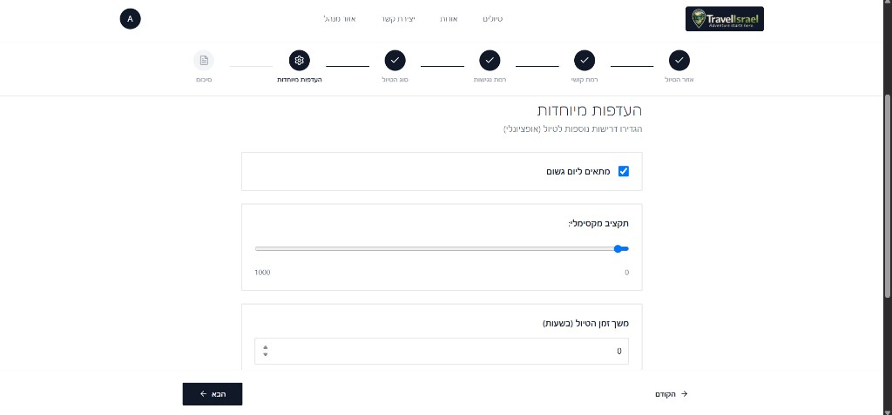

**העדפות מיוחדות**

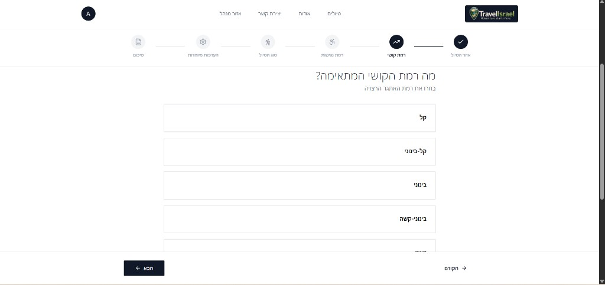

**סיכום + תוצאות**

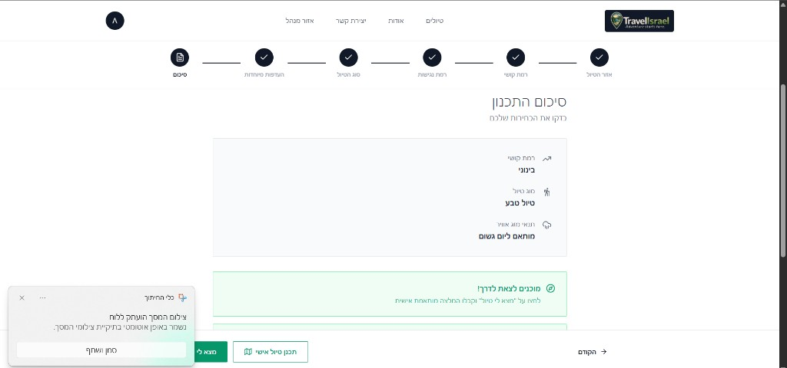

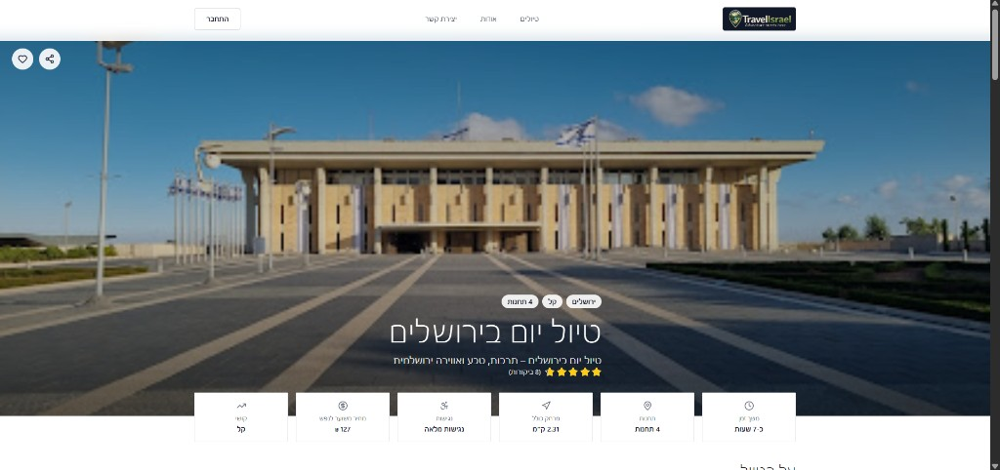

---

### בניית טיול אישי

**טופס פרטי הטיול** (`/BuildTrip`)

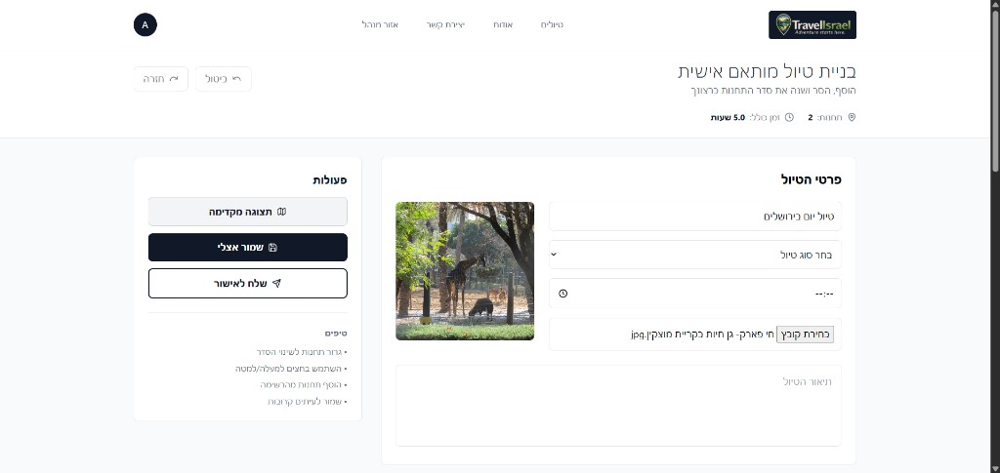

**תחנות המסלול**

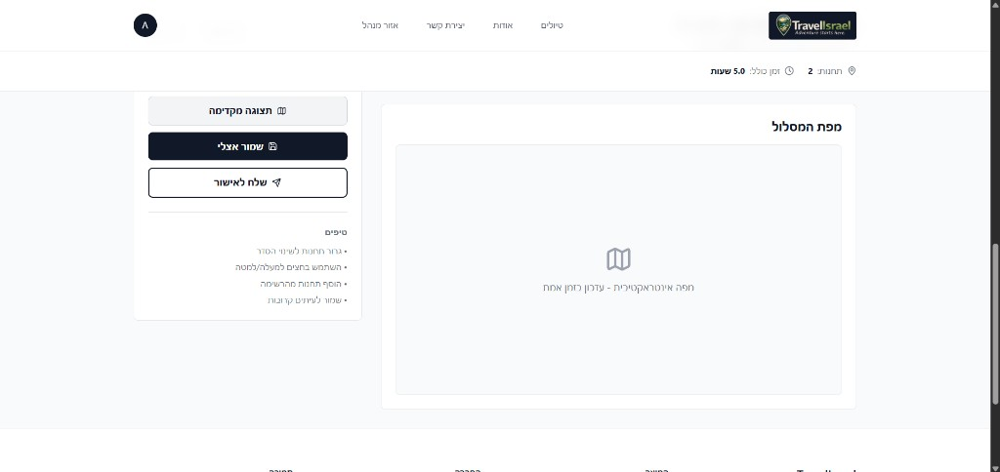

---

### אזור אישי

**פרופיל וסטטיסטיקות** (`/me`)

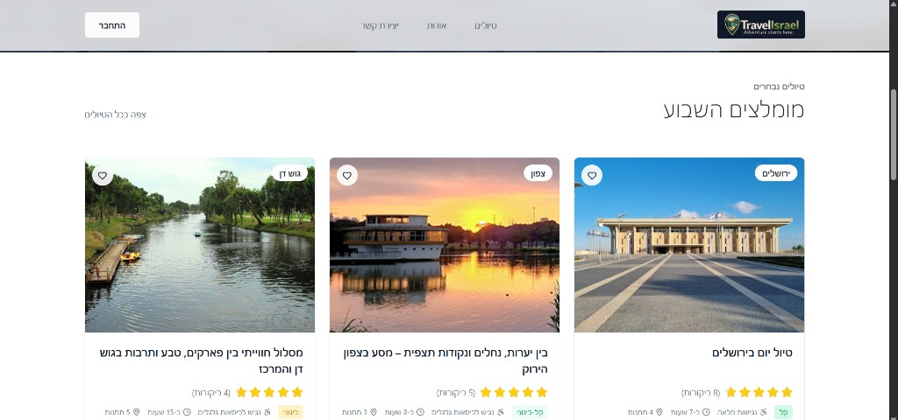

---

### פאנל ניהול (Admin)

**Dashboard** (`/admin/dashboard`)

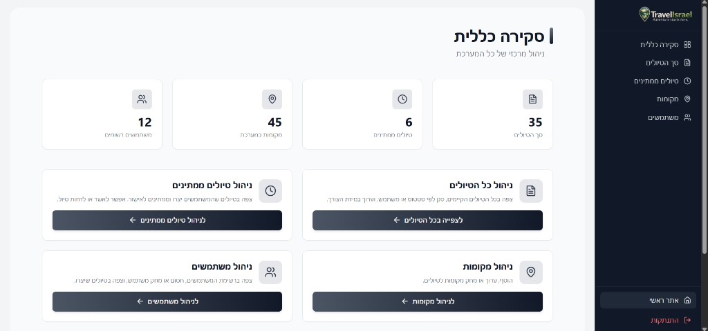

**ניהול מקומות** (`/admin/places`)

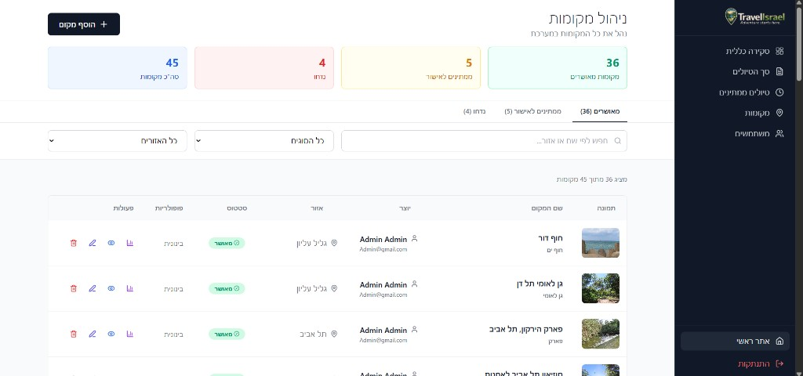

**טיולים ממתינים לאישור** (`/admin/trips/pending`)

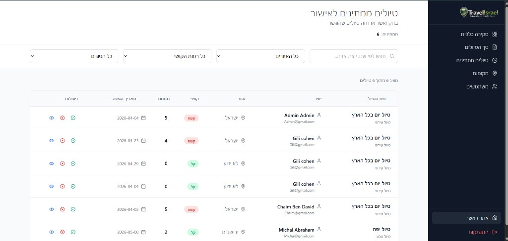

---

## מבנה הפרויקט

```
ProjectTrips/
├── docs/
│   └── screenshots/   # צילומי מסך לתיעוד
├── public/
├── src/
│   ├── auth/           # Auth Context, Guards, JWT utilities
├── component/      # קומפוננטות משותפות
├── hooks/          # Custom React hooks
├── layouts/        # Layout, NavBar, Footer, AdminLayout
├── pages/          # דפי האפליקציה
├── redux/          # Store, Slices, Thunks
├── routes/         # Router + Paths
├── sections/       # מקטעים לפי feature (wizard, trip, filters)
├── services/       # קריאות API (Axios)
├── types/          # TypeScript interfaces
└── utils/          # פונקציות עזר
```

---

## סקריפטים

| פקודה | תיאור |
|-------|--------|
| `npm run dev` | הרצה ב-Development עם HMR |
| `npm run build` | Build ל-Production |
| `npm run preview` | תצוגה מקדימה של ה-Build |
| `npm run lint` | בדיקת ESLint |

---

## מסכים ונתיבים

| נתיב | מסך | הרשאה |
|------|-----|--------|
| `/home` | דף בית | כולם |
| `/trips` | רשימת טיולים | כולם |
| `/trips/:id` | פרטי טיול | כולם |
| `/tripPlan` | אשף תכנון טיול | כולם |
| `/planningResultPage` | תוצאות המלצות | כולם |
| `/BuildTrip` | בניית טיול חדש | כולם |
| `/BuildTrip/:tripId` | עריכת טיול | כולם |
| `/me` | אזור אישי | משתמש מחובר |
| `/login` | התחברות | כולם |
| `/register` | הרשמה | כולם |
| `/about` | אודות | כולם |
| `/contact` | צור קשר | כולם |
| `/admin/dashboard` | Dashboard | Admin |
| `/admin/trips` | ניהול טיולים | Admin |
| `/admin/trips/pending` | טיולים ממתינים | Admin |
| `/admin/places` | ניהול מקומות | Admin |
| `/admin/users` | ניהול משתמשים | Admin |

---

## תמיכה ומשוב

לשאלות, באגים או הצעות — פתחי **Issue** ב-GitHub.  
ניתן גם לפנות דרך דף **צור קשר** (`/contact`) בתוך האפליקציה.
